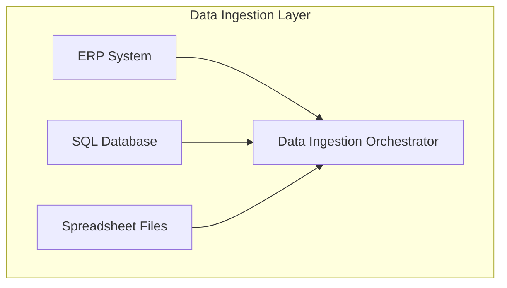
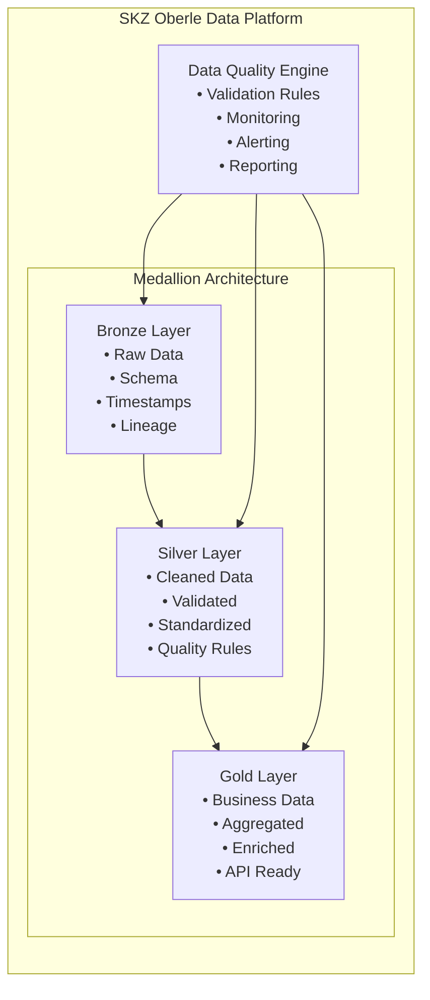
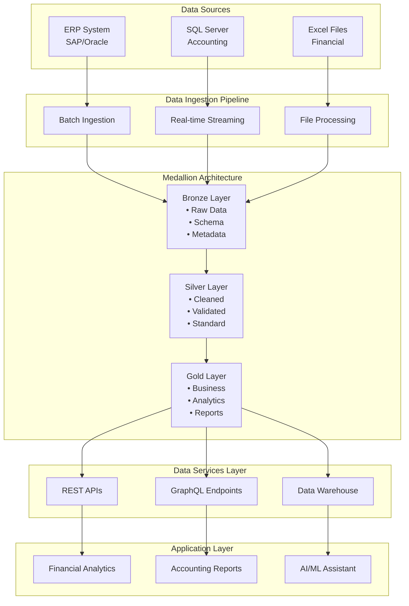

# Architectural Tactics for Data Flow and Transformations

## Self-Study Resources

### Required Reading

| Resource | Topic | Focus Area | Estimated Time |
|----------|-------|------------|----------------|
| [Case Study: Medallion Architecture in an E-Commerce Company](https://cobalt-blarney-8b3.notion.site/Case-Study-Medallion-Architecture-in-an-E-Commerce-Company-25a256ceaea780feb249d8968878f9fb) | Medallion Architecture Implementation | Real-world application of Bronze, Silver, Gold layers in enterprise context | 45 minutes |
| [The Easy Guide to Component Diagrams](https://creately.com/blog/software-teams/component-diagram-tutorial/) | UML Component Diagrams | Component notation, interfaces, dependencies, and best practices | 30 minutes |
| [The Race For Data Quality in a Medallion Architecture](https://datakitchen.io/the-race-for-data-quality-in-a-medallion-architecture/) | Data Quality in Medallion Architecture | Quality controls, monitoring, and governance across architecture layers | 25 minutes |

 

## Case Study: Medallion Architecture
### Business Context
Our project involves creating a unified data platform for SKZ Oberle, integrating fragmented data sources (ERP systems, SQL databases, spreadsheets) into a centralized, scalable architecture.

### Key Requirements
- **Data Integration**: Multiple source systems (ERP, databases, spreadsheets)
- **Data Quality**: Automated validation and cleansing processes
- **Scalability**: Handle growing data volumes and user demands
- **Security**: Enterprise-grade access control and audit trails
- **Future-Ready**: Foundation for AI/ML and natural language interfaces

## Architectural Thinking: ISO Views and ATAM Tradeoffs

### Critical Question: How long will it take to process all data to the data warehouse?

This fundamental question leads us to consider multiple architectural dimensions that directly impact the performance, quality, and viability of our data solution.

However, this is an amateur question. A systems thinker needs to address more complex considerations:

- **Throughput Analysis**: Our system, with an input of X GB/s, can process up to Y million records, but this creates critical tradeoffs between speed and quality
- **Resource Constraints**: Processing capacity is bounded by CPU cores, memory allocation, and I/O bandwidth, each with different scaling characteristics
- **Data Quality Impact**: Higher processing speeds may compromise data validation, leading to downstream quality issues
- **Cost-Performance Balance**: Faster processing requires more expensive infrastructure, creating a direct cost-performance tradeoff
- **System Reliability**: Increased throughput often reduces fault tolerance, making the system more vulnerable to failures
- **Scalability Limits**: Linear scaling assumptions break down at certain thresholds, requiring architectural redesign

These tradeoffs force us to think beyond simple "how fast" questions and consider the holistic system behavior, quality attributes, and long-term sustainability of our architectural decisions.

For each business driver, there exists a tradeoff that architects must carefully balance to make informed decisions.

### ISO/IEC 25010 Quality Model


The ISO 25010 quality model provides a comprehensive framework for evaluating software and system quality characteristics. For Big Data architectures, each quality characteristic has direct implications on processing time:

#### Quality Characteristics Relevant to Big Data

**Performance Efficiency**
- **Throughput**: Volume of data processed per unit of time
- **Time Behavior**: End-to-end processing latency
- **Resource Utilization**: Efficiency in CPU, memory, and I/O usage

**Reliability**
- **Fault Tolerance**: Ability to recover from failures without data loss
- **Recoverability**: Time to restore operations after failures
- **Availability**: Processing system uptime

**Usability**
- **Operability**: Ease of monitoring and maintenance
- **User Error Protection**: Prevention of errors that may impact processing

### The 5 Views of ISO Architecture


Each architectural view offers a unique perspective on how to optimize processing time:

#### 1. Logical View
- **Components**: How processing modules are organized
- **Interfaces**: How data flows between components
- **Responsibilities**: Clear separation of responsibilities for optimization

#### 2. Process View
- **Concurrency**: Parallelization of processing tasks
- **Synchronization**: Coordination between processes
- **Deadlocks**: Prevention of blocks that impact performance

#### 3. Physical View
- **Deployment**: Distribution of components across servers
- **Network**: Network topology for data transfer
- **Hardware**: Machine specifications for processing

#### 4. Development View
- **Modules**: Code organization for maintainability
- **Dependencies**: Management of dependencies between modules
- **Versioning**: Version control for evolution

#### 5. Use Case View
- **Scenarios**: Data processing flows
- **Actors**: Users and systems that interact
- **Functionality**: Functional processing requirements

### ATAM (Architecture Tradeoff Analysis Method)


ATAM helps us identify and analyze critical tradeoffs that directly impact processing time:

#### Critical Architectural Tradeoffs for Big Data

**1. Latency vs. Throughput**
- **Decision**: Batch processing vs. real-time streaming
- **Tradeoff**: Lower latency may reduce total throughput
- **Time Impact**: Streaming may be faster for critical data, but batch is more efficient for large volumes

**2. Consistency vs. Availability**
- **Decision**: ACID vs. BASE (Basically Available, Soft state, Eventual consistency)
- **Tradeoff**: Strong consistency may impact performance
- **Time Impact**: Eventual consistency allows faster processing

**3. Scalability vs. Complexity**
- **Decision**: Horizontal vs. vertical scaling
- **Tradeoff**: Horizontal scalability adds coordination complexity
- **Time Impact**: Horizontal scalability may reduce total time, but increases operational complexity

**4. Storage vs. Processing**
- **Decision**: Storage-first vs. compute-first architectures
- **Tradeoff**: More storage may reduce need for reprocessing
- **Time Impact**: Optimized storage can accelerate future queries

#### Sensitivity Analysis for Processing Time

**Critical Factors that Impact Time:**

1. **Data Volume**
   - Impact: Linear on processing time
   - Mitigation: Partitioning and parallelization

2. **Transformation Complexity**
   - Impact: Exponential with business rule complexity
   - Mitigation: Simplification and algorithm optimization

3. **Data Quality**
   - Impact: Dirty data increases cleaning time
   - Mitigation: Source validation and quality rules

4. **Infrastructure**
   - Impact: Inadequate hardware limits performance
   - Mitigation: Proper sizing and optimization

### Architectural Strategies for Time Optimization

#### 1. Optimized Layered Architecture
```
Bronze (Raw) → Silver (Cleaned) → Gold (Business)
     ↓              ↓                ↓
  Fast Ingestion → Quality Gates → Business Logic
```

#### 2. Parallel Processing
- **Horizontal Partitioning**: Data division by keys
- **Vertical Partitioning**: Separation by columns
- **Pipeline Processing**: Overlapping stage processing

#### 3. Caching and Materialization
- **Result Caching**: Cache of intermediate results
- **Pre-aggregation**: Pre-calculated aggregations
- **Materialized Views**: Materialized views for frequent queries

#### 4. Continuous Monitoring and Optimization
- **Performance Metrics**: Processing time metrics
- **Bottleneck Identification**: Gargalos identification
- **Auto-scaling**: Automatic scalability based on load

### Conclusion: Balancing Quality and Performance

The question "How long will it take to process all data to the data warehouse?" doesn't have a single answer, but rather a set of architectural decisions that must be made considering:

- **Business Requirements**: SLAs and time expectations
- **Quality Characteristics**: Balance between performance, reliability, and usability
- **ATAM Tradeoffs**: Costs and benefits of each architectural decision
- **Multiple Views**: Consideration of all architectural perspectives

The final architecture should be the result of an iterative process of analysis, prototyping, and optimization, always maintaining focus on business value and system quality.

## UML Component Diagrams for Big Data Architecture

### Component Diagram Fundamentals

Based on [Creately's Component Diagram Tutorial](https://creately.com/blog/software-teams/component-diagram-tutorial/), component diagrams visualize system architecture by showing:

- **Components**: Modular parts that encapsulate functionality
- **Interfaces**: How components interact (provided/required)
- **Dependencies**: Relationships between components
- **Ports**: Delegation points for internal interactions

Suggested tools for diagramming: [Lucidchart](https://www.lucidchart.com) and [draw.io (diagrams.net)](https://www.diagrams.net/).

### Big Data Architecture Components

#### 1. Data Ingestion Layer



#### 2. Medallion Architecture Layers

**Bronze Layer (Raw Data)**
- Raw data ingestion and storage
- Minimal processing and validation
- Historical data preservation
- Schema evolution support

**Silver Layer (Cleaned Data)**
- Data quality validation
- Standardization and normalization
- Business rule application
- Data lineage tracking

**Gold Layer (Business-Ready Data)**
- Aggregated and enriched data
- Business metrics and KPIs
- Analytics-ready datasets
- API-ready data products

### Component Diagram Symbols and Usage

#### Component Notation
- **Rectangle with <<component>>**: Standard component representation
- **Rectangle with component icon**: Visual component identification
- **Rectangle with both icon and stereotype**: Complete component definition

#### Interface Types
- **Provided Interface (Circle)**: Services offered by component
- **Required Interface (Semi-circle)**: Services needed by component
- **Assembly Connector**: Links provided and required interfaces

#### Ports and Dependencies
- **Ports**: Small squares for interface delegation
- **Dependencies**: Dashed arrows showing component relationships

## Medallion Architecture Implementation

### Architecture Overview



### Data Quality in Medallion Architecture

Based on [DataKitchen's insights on data quality in Medallion Architecture](https://datakitchen.io/the-race-for-data-quality-in-a-medallion-architecture/), implementing robust data quality controls is crucial:

#### Quality Gates by Layer

**Bronze Layer Quality Controls**
- Schema validation
- Data type checking
- Null value detection
- Duplicate identification

**Silver Layer Quality Controls**
- Business rule validation
- Referential integrity checks
- Data completeness verification
- Anomaly detection

**Gold Layer Quality Controls**
- Aggregation accuracy
- Metric consistency
- Performance validation
- Business logic verification

## SKZ Oberle Big Data Architecture Design

### Component Architecture



### Data Flow Patterns

#### 1. Batch Processing Pattern
```
Data Source → Ingestion → Bronze → Silver → Gold → API/Reports
```

#### 2. Real-time Processing Pattern
```
Data Source → Streaming → Bronze → Silver → Gold → Real-time Analytics
```

#### 3. Data Quality Pipeline
```
Data → Validation → Quality Rules → Monitoring → Alerting → Reporting
```

## Implementation Guidelines

### Component Design Principles

1. **Modularity**: Each component should have a single responsibility
2. **Loose Coupling**: Minimize dependencies between components
3. **High Cohesion**: Related functionality should be grouped together
4. **Interface Segregation**: Provide clear, focused interfaces
5. **Dependency Inversion**: Depend on abstractions, not concretions

### Data Quality Implementation

#### Quality Metrics
- **Completeness**: Percentage of non-null values
- **Accuracy**: Data correctness against business rules
- **Consistency**: Cross-system data alignment
- **Timeliness**: Data freshness and availability
- **Validity**: Data format and type compliance

#### Monitoring and Alerting
- Real-time quality dashboards
- Automated anomaly detection
- Data lineage tracking
- Performance monitoring
- Cost optimization tracking

## Graded Activity

### Activity Overview
- **Duration**: 1 hour (in-class)
- **Format**: Individual work
- **Points**: 3 points
- **Deadline**: 12:00 hours (exactly)

### Activity Description

Students are required to design a data architecture proposal that covers the entire data lifecycle, including data ingestion, data processing (treatment), and data visualization. The data visualization component must be an **infographic** that students will need to design using appropriate tools or creative methods. The architecture should clearly illustrate how data flows from sources through transformation stages to final presentation layers, emphasizing scalability, efficiency, and clarity.

### Activity Instructions

Design a data architecture proposal that covers the entire data lifecycle, including data ingestion, data processing (treatment), and data visualization. Your proposal should include a clear architectural diagram illustrating the flow of data from its sources through transformation stages to the final presentation layers. 

**Important**: The data visualization component must be designed as an **infographic**. You will need to:
- Research and select appropriate infographic creation tools
- Design a creative and informative infographic
- Integrate the infographic into your overall architecture design
- Explain how the infographic fits into the data flow

Emphasize scalability, efficiency, and clarity.

### Checklist for Coverage

Your architecture proposal must include:

- [ ] **Include all three lifecycle stages**: ingestion, processing, and visualization
- [ ] **Clearly identify data sources and ingestion mechanisms**
- [ ] **Show logical and well-structured processing/treatment steps**
- [ ] **Include data visualization or presentation components (infographic required)**
- [ ] **Demonstrate clear and organized data flow between components**
- [ ] **Provide explanations for the role of each component**
- [ ] **Address considerations for data quality, storage, and accessibility**
- [ ] **Reflect principles of scalability and system efficiency**


### Important Notes

- **Deadline**: Activity closes exactly at 12:00 hours
- **Format**: Individual work only
- **Submission**: Follow the platform instructions for submission
- **Late Submissions**: Will not be accepted after the deadline

---

*This lesson provides the foundation for designing robust, scalable Big Data architectures using industry-standard patterns and practices. Students will apply these concepts to design the SKZ Oberle data platform architecture.*